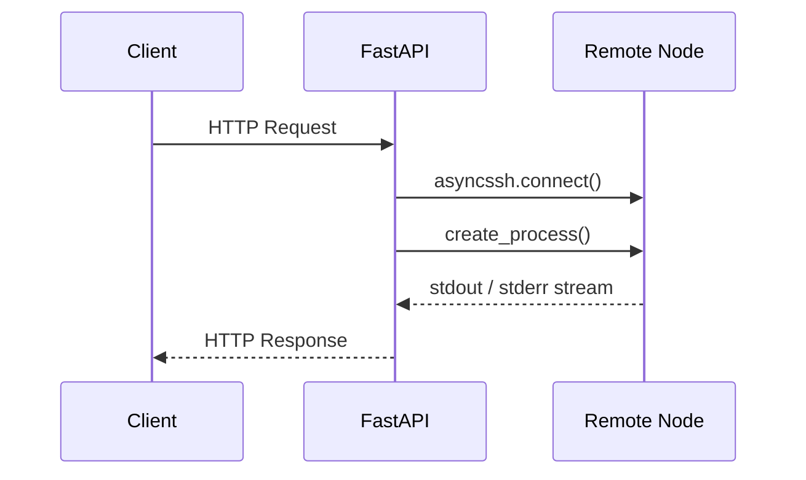
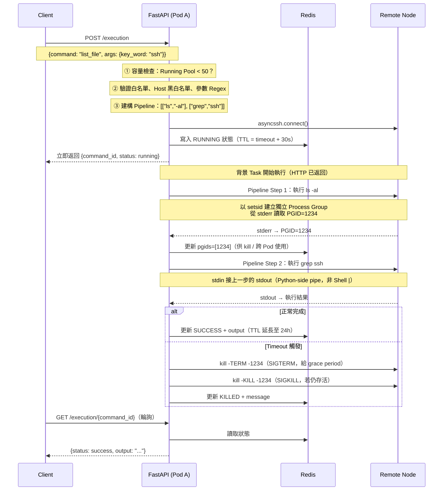
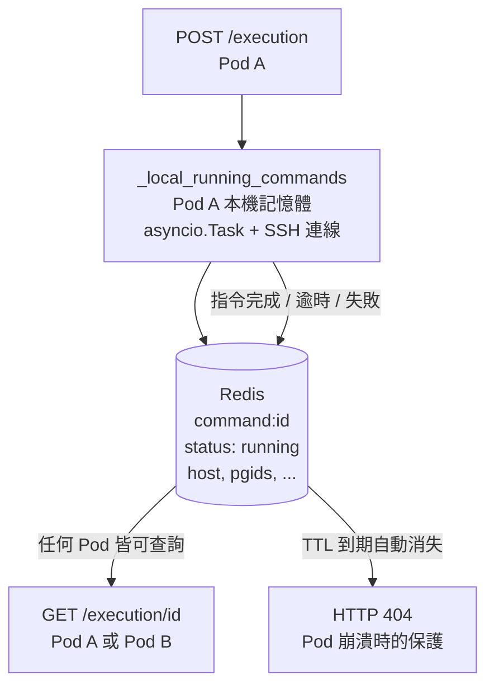
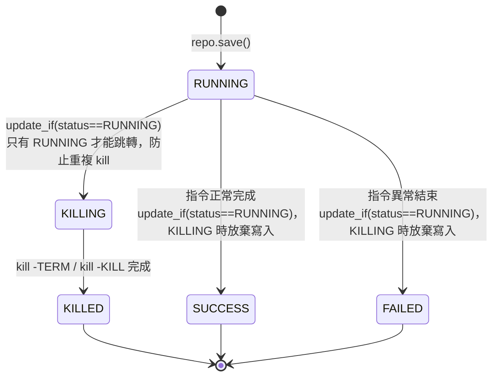
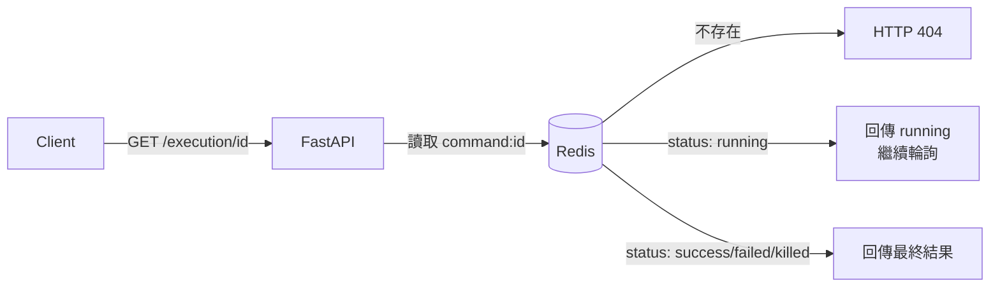
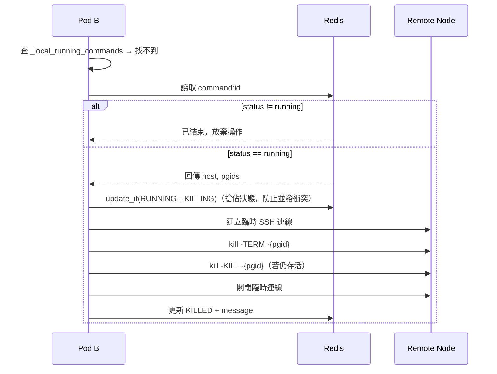

# SSH Command Execution — Architecture & Design
---

## 前言

deploy-service 提供其他 service 包含 vm, cluster, bm 等 SSH 到節點執行操作的能力，這樣可以統一處理節點的 ssh 憑證問題, 安全性上的設計與考量等。


## Goal && Non Goal

- Goal
  - 說明 `deploy-service` 如何安全地代理其他服務對遠端節點執行 SSH 指令
  - 說明系統如何防止 Shell Injection，確保用戶輸入無法被執行為惡意指令
  - 說明指令的完整生命週期管理：從接收請求、背景執行、timeout 處理，到結果回傳
  - 說明在 K8s 多 Pod 環境下，如何跨節點安全查詢與中止指令
- Non Goal
  - 不討論 SSH 憑證的產生與 Rotation 流程（由 Infra 層負責）
  - 不討論 VM / Cluster / BM 各服務自身的業務邏輯
  - 不討論 FastAPI 的通用認證機制（JWT / Scope 管理）

## 目錄
> 本文件描述 `deploy-service` 中 SSH 遠端指令執行功能的核心設計理念，涵蓋安全防注入機制、進程生命週期管理、斷線指令處理、以及結果輪詢快取等關鍵架構。

1. [系統總覽](#1-系統總覽)
2. [請求生命週期](#2-請求生命週期)
3. [白名單與管線設計](#3-白名單與管線設計)
4. [Anti-Injection 防注入架構](#4-anti-injection-防注入架構)
5. [進程群組追蹤與 Timeout Kill 機制](#5-進程群組追蹤與-timeout-kill-機制)
6. [Fire-and-Forget 斷線指令（如 Reboot）](#6-fire-and-forget-斷線指令如-reboot)
7. [Running Pool 與 Results Pool](#7-running-pool-與-results-pool)
8. [Graceful Shutdown（優雅關機）](#8-graceful-shutdown優雅關機)
9. [Concurrency Protection（並行保護）](#9-concurrency-protection並行保護)
10. [結構化日誌](#10-結構化日誌)
11. [附錄：核心檔案索引](#11-附錄核心檔案索引)

---

## 1. 系統總覽

本模組讓授權使用者透過 REST API 在遠端主機上執行**預定義的白名單指令**。不允許任意字串直接傳入 Shell，所有可執行的指令皆須事先在 JSON 設定檔中以管線（Pipeline）形式定義。



**核心約束**：
- 使用者**無法自行決定要執行什麼指令**，只能從白名單中選取。
- 使用者**唯一能控制的**是白名單中預留的參數（argument），而這些參數受到多層驗證保護。

---

## 2. 請求生命週期

### 2.1 設計前的思考：我們要解決什麼問題？

在動手寫程式碼之前，我們先問自己：一個生產環境的 SSH 代理服務，需要面對哪些現實挑戰？

**服務可靠性**

> 想像一下：如果每個 API 請求都直接開一條 SSH 連線、無限制地等待遠端執行結果，會發生什麼事？

- 同時有 100 個請求進來 → 100 條 SSH 連線 → File Descriptor 耗盡、Event Loop 過載，服務 OOM 崩潰
- 某個指令卡住不回應 → 這條連線永遠佔著資源，不釋放
- 部署到 K8s 後，Pod A 執行了一個指令，Pod B 要查狀態 → 記憶體裡找不到，回傳 404

這些都是不加控制就必然發生的問題。

**安全性**

> 只要讓使用者填入任意指令字串，系統就等同於把 Root Shell 交出去。

- 如何讓使用者能「自訂參數」，又不讓他們執行任意指令？
- 即使有 Regex 驗證，如果最後還是把字串拼進 `sh -c "..."` 裡，驗證等於白做
- 如果遠端指令跑了 10 分鐘還沒結束，要怎麼把它殺掉？殺的時候如何確保連子進程都一起清掉？

**實用性**

> 一個純粹「安全卻難用」的系統，最終會被人繞過或棄用。

- 需要支援 pipe（例如 `ls | grep keyword`），而且不能為了安全而犧牲這個功能
- 長時間執行的指令（如備份、壓縮）不能讓 HTTP 請求超時，要能「丟進背景、立刻返回」
- 背景執行的結果要能被後續的輪詢請求取得——而且在多 Pod 環境下，任何一個 Pod 都能查

### 2.2 這些問題如何對應到架構設計

| 挑戰 | 解決方案 | 對應章節 |
|---|---|---|
| 連線數爆炸 / OOM | Running Pool 上限 + Semaphore 雙層限流 | §9 |
| 指令卡住不回應 | Timeout + 兩階段 PGID Kill | §5 |
| 跨 Pod 狀態查詢 | Redis 作為共享狀態存儲 | §7 |
| 跨 Pod 中止指令 | 讀 Redis 取得 PGID，動態建 SSH 連線發送 kill | §7 |
| 任意指令注入 | 白名單 + shlex 定位引數（三層防禦） | §3、§4 |
| 支援 pipe 又防注入 | Python-side 管線串接，完全不用 Shell `\|` | §3 |
| 長時間指令 + HTTP 超時 | 非同步背景 Task，立即返回 command_id | 下方 §2.3 |

### 2.3 一個指令的完整旅程

搞清楚要解決什麼問題之後，我們來看一個請求從進來到結束的完整流程。

以下用一個具體例子來說明：
- 假設管理員想列出遠端節點上的檔案，並篩選出含有 `ssh` 關鍵字的項目。
- 這個需求在白名單中被定義為一個叫 `list_file` 的指令，接受一個使用者參數 `key_word`。
- 底層會拆成兩個步驟執行：先 `ls -al` 列出所有檔案，再把結果 pipe 給 `grep {key_word}` 篩選
  - 但這個 pipe 不是 Shell 的 `|`，而是由 Python 在程式層串接，這正是防注入的關鍵之一（§3 會詳細說明）。



**為什麼要立刻返回 `command_id`，而不等指令完成？**

這是這個架構中最重要的設計決策之一。HTTP 連線本身有超時限制，代理層（如 Nginx、Load Balancer）通常在 30～60 秒後就會強制斷線。如果我們等指令執行完才回應，遇到長時間指令（備份、資料遷移）必然超時，而且 Client 斷線後也無從得知指令的最終結果。

改成非同步模式後：
- **Client 立刻拿到 `command_id`**，HTTP 連線可以安全關閉
- **指令在背景 Task 繼續執行**，結果寫入 Redis
- **Client 透過輪詢** `GET /execution/{id}` 取得最終結果
- **任何一個 Pod** 都可以回應這個輪詢請求（狀態在 Redis，不在記憶體）

### 2.4 對應到程式碼結構

因此，為了應對以上狀況，一個指令從接收到完成，會依序經過以下階段。每個階段對應 `CommandService` 中的一個獨立方法，遵循 Single Responsibility Principle：

```
execute_command()          ← 頂層 Orchestrator
 ├─ _check_capacity()      ← 檢查 Pod 本機連線數
 ├─ _prepare_execution()   ← 解析白名單、驗證參數 (Regex/Anti-Injection)、載入 SSH 設定
 ├─ _build_pipeline()      ← 將 {placeholder} 替換為實際參數值
 ├─ _connect()             ← 建立 SSH 連線
 └─ 分流  ──┬─ _handle_fire_and_forget()   ← 白名單設定 disconnects_ssh=true 的指令
           │                                 代表這個指令執行後預期會主動斷線（如 reboot）
           │                                 詳見 §6
           └─ _handle_async_execution()   ← 一般指令（背景執行 + 超時控制）
                ├─ repo.save()            ← 初始化 CommandStatus.RUNNING 並存入 Redis
                ├─ _execute_pipeline()    ← 建立 Process (setsid)、擷取 PGID
                ├─ repo.update(pgids)     ← 將執行中的進程群組 ID 回填至 Redis
                ├─ _collect_output()       ← 收集最終輸出
                └─ _store_result()        ← 呼叫 repo.update 標註成功或失敗
```

所有階段所需的上下文資訊統一封裝在 `ExecutionContext` Dataclass 中，避免冗長的函式參數傳遞：

```python
@dataclass
class ExecutionContext:
    username: str
    request_id: str
    command_name: str
    raw_request: CommandExecutionRequest
    cmd_config: CommandWhitelistConfig
    ssh_config: SSHConnectionConfig
    conn: Optional[asyncssh.SSHClientConnection] = None
    pipeline_cmds: List[List[str]] = field(default_factory=list)
```

---

## 3. 白名單與管線設計

### 設定檔結構

每個角色可以設置自己的白名單設定檔，例如 `data/allow-commands-{account}.json`：

```json
{
  "name": "admin",
  "allow_hosts": [
    ".*"
  ],
  "deny_hosts": [
    "10\\.0\\..*"
  ],
  "allow_commands": [
    {
      "command_name": "list_file",
      "description": "列出檔案並篩選關鍵字",
      "disconnects_ssh": false,
      "killable": true,
      "pipeline": [
        { "command": ["ls", "-al"] },
        { "command": ["grep", "{key_word}"] }
      ],
      "arguments": [
        {
          "name": "key_word",
          "type": "string",
          "validation_regex": "^[a-zA-Z0-9._-]+$"
        }
      ]
    }
  ]
}
```

### 關鍵欄位說明

| 欄位 | 用途 |
|---|---|
| `allow_hosts` | 允許發送指令的 Host IP/Hostname 正則表達式列表。預設為 `[".*"]`。 |
| `deny_hosts` | 禁止發送指令的 Host IP/Hostname 正則表達式列表（黑名單優先）。預設為 `[]`。 |
| `pipeline` | 依序執行的指令陣列，每個 step 是一個 `command: List[str]`。多個 step 會透過 Python 管線串接（stdin → stdout）。 |
| `arguments` | 使用者可替換的 `{placeholder}` 參數定義。每一個必須包含 `validation_regex` 來限縮合法輸入範圍。 |
| `disconnects_ssh` | 設為 `true`時，系統預期指令會主動切斷 SSH 連線（如 `reboot`），走「Fire-and-Forget」路徑。 |
| `killable` | 是否允許在 timeout 時主動 kill 該指令的進程群組。 |

### 主機存取控制 (Host Filtering)

在 `_prepare_execution` 階段，系統會根據設定檔中的 `deny_hosts` 與 `allow_hosts` 進行正則匹配校驗：
1. **黑名單優先**：若目標 Host 匹配 `deny_hosts` 中的任一項目，立即拒絕。
2. **白名單校驗**：若目標 Host 不匹配 `allow_hosts` 中的任何項目，亦會拒絕。


### Python-Side 管線串接

多步驟管線**不使用** Shell 的 `|` 管道符號。取而代之，我們在 Python 端透過 `asyncssh` 的 `stdin=prev.stdout` 參數將前一步的 stdout 直接導入下一步的 stdin：

```python
for i, cmd_args in enumerate(pipeline_cmds):
    p = await conn.create_process(
        command_str,
        stdin=prev_stdout,              # ← Python-side piping
        stdout=asyncssh.PIPE,
        stderr=asyncssh.PIPE
    )
    prev_stdout = p.stdout
```

**優勢**：避免在遠端 Shell 解析 `|`，徹底杜絕透過管道符號注入額外指令的可能性。

---

## 4. Anti-Injection 防注入架構

這是本系統最核心的安全設計。防禦策略分為 **三層**：

### 第一層：字元黑名單（Early Rejection）

在參數進入任何處理流程之前，`_validate_anti_injection()` 會立即掃描是否包含高風險字元：

```python
dangerous_chars = [";", "&", "|", "$", "`"]
if any(char in user_input for char in dangerous_chars):
    raise CommandExecutionException("Invalid characters detected in input.")
```

這一層的目的是**提早拒絕明顯惡意的輸入**，減少後續處理的攻擊面。

### 第二層：Regex 白名單驗證

每個參數在白名單設定中都可以定義 `validation_regex`，例如：
- 數字型參數：`^[0-9]+$`
- 檔案名稱型：`^[a-zA-Z0-9._-]+$`

```python
if arg_conf.validation_regex:
    if not re.match(arg_conf.validation_regex, val_str):
        raise CommandExecutionException("...")
```

### 第三層：shlex 定位引數隔離（Architecture-Level Guarantee）

這是最關鍵也最精巧的一層。即使前面兩層被繞過，這一層在架構上**保證了 Shell Injection 不可能成功**。

#### 為什麼 `sh -c` 通常很危險？

`sh -c` 的問題在於它接受一個**字串**，並把這個字串交給 Shell 完整解析。Shell 解析的過程中會展開 `;`、`|`、`&&`、`$()` 等特殊語法。這意味著只要有任何使用者輸入被拼接進這個字串，攻擊者就有機會注入額外的 Shell 指令：

```bash
# 危險的做法：把使用者輸入直接拼進字串
sh -c "grep hello; rm -rf /"
#             ↑ 使用者輸入      ↑ Shell 解析後真的執行了 rm -rf /
```

我們使用以下 wrapper 結構來追蹤 Process Group ID (PGID)：

```python
wrapper = ["setsid", "-w", "sh", "-c", 'echo $$ >&2; exec "$@"', "_"]
full_cmd = wrapper + cmd_args   # e.g., + ["grep", "用戶輸入值"]
command_str = shlex.join(full_cmd)
```

#### `setsid` 做了什麼？

在 Linux 中，每個進程都屬於一個 **Process Group**，而 Process Group 又隸屬於一個 **Session**。SSH daemon 本身就是一個 Session Leader，透過 SSH 執行的指令預設會繼承這個 Session，也就是和 SSH daemon 同一個 Process Group。

這會帶來一個問題：當我們想用 `kill -TERM -{pgid}` 終止某個指令時，如果它的 PGID 和 SSH daemon 共用，我們就沒辦法精準只殺掉這個指令——搞不好會連 SSH 連線本身也一起打掉。

`setsid` 的作用是**強制建立一個全新的 Session 與 Process Group**，讓目標指令從 SSH daemon 的 process tree 中完全獨立出來：

```
SSH daemon (Session A)
  └─ ...（其他連線）

setsid 建立的新 Session (Session B)
  └─ grep   ← PGID=1234，獨立存在，可以精準 kill
```

這樣一來，`kill -TERM -1234` 只會打到這個指令的整個 process tree，不會誤傷其他連線或 SSH daemon 本身。

#### 我們的做法為何安全？

關鍵在於：我們傳給 `sh -c` 的腳本字串是**固定不變的** `echo $$ >&2; exec "$@"`，使用者輸入**從未被拼接進這個字串**。使用者的值是透過 `$@`——也就是 Shell 的**定位引數（Positional Arguments）**——傳入的。

以執行 `cmd = ["grep", "hello; rm -rf /"]` 為例，Shell 內部看到的是：

```
$0 = _               ← 慣例 placeholder
$1 = grep            ← 白名單定義的執行檔
$2 = hello; rm -rf / ← 使用者輸入，整體是 $2 這一個引數的「值」
```

`exec "$@"` 展開後等同於 `exec "$1" "$2"`，每個引數都被雙引號保護，Shell **不會再對其內容做任何解析**。所以攻擊者輸入的 `; rm -rf /` 只是 `grep` 收到的一個純字串參數，不會被執行為指令。

這看起來像是在使用 `sh -c`（通常被認為危險），但實際上**使用者輸入從未進入 `sh -c` 的腳本字串中**。假設用戶輸入了惡意值 `$(rm -rf /)`，最終產生的指令會是：

```bash
setsid -w sh -c 'echo $$ >&2; exec "$@"' _ grep '$(rm -rf /)'
```

#### 運作原理解析

讓我們逐步分析 Shell 如何解讀這段指令：

| 位置 | Shell 變數 | 實際值 | 說明 |
|---|---|---|---|
| `sh -c` 的腳本 | — | `echo $$ >&2; exec "$@"` | **固定不變**，不含任何用戶輸入 |
| `$0` | `_` | `_` | 慣例的 placeholder |
| `$1` | `"$1"` | `grep` | 白名單定義的執行檔名 |
| `$2` | `"$2"` | `$(rm -rf /)` | **被當作純粹的字串值，不會被 Shell 展開** |

`exec "$@"` 的行為等同於 `exec "$1" "$2" "$3" ...`。我們還有透過 `shlex.join()` 額外確保了每個陣列元素在傳輸時被正確的 Shell 引號包裹（使用單引號），防止特殊字元在 SSH 傳輸層被意外解讀。Shell 不會對它們進行：
- 變數展開 (`$VAR`, `${VAR}`)
- 命令替換 (`$(...)`, `` `...` ``)
- 路徑展開 (`*`, `?`)
- 分詞 (word splitting)

#### 為什麼不直接拔掉 `sh -c`？

我們保留 `sh -c` 是為了一個不可替代的功能：**擷取 PGID**。

```bash
echo $$ >&2;     # 將當前 Shell 的 PID（即 PGID）寫入 stderr
exec "$@"        # 用 exec 替換自身為目標指令，繼承同一個 PID
```

這個 PGID 是後續 timeout 精準獵殺機制的基礎。如果拿掉 `sh -c`，我們便完全失去追蹤進程群組的能力。

**為什麼輸出到 stderr 而不是 stdout？**

因為 stdout 是指令執行結果的傳輸通道。在 pipeline 設計中，每個 step 的 stdout 會被接到下一個 step 的 stdin（`stdin=prev_stdout`）。如果把 PGID 也寫進 stdout，它就會混入真正的指令輸出，污染下一個 step 的輸入資料。

stderr 是獨立的頻道，不參與 pipeline 的資料流，Python 端可以在不干擾指令執行的情況下從 `p.stderr.readline()` 單獨讀出 PGID。

---

## 5. 進程群組追蹤與 Timeout Kill 機制

### 為什麼需要 PGID？

在 SSH 遠端執行指令時，如果直接對 SSH channel 下達中斷，遠端的子進程可能會脫離控制變成孤兒進程 (Orphan Process)。透過追蹤 PGID，我們可以精準找到並終止整個進程樹。

### setsid 隔離策略

```python
wrapper = ["setsid", "-w", "sh", "-c", 'echo $$ >&2; exec "$@"', "_"]
```

| 元件 | 職責 |
|---|---|
| `setsid` | 建立全新的 Session 與 Process Group，確保目標指令不會從屬於 SSH daemon 的 process group |
| `-w` | 等待子進程結束才返回，確保外層可以正確偵測完成狀態 |
| `sh -c '...'` | 在新 session 內啟動 Shell，印出 PGID 後透過 `exec` 無痕替換為目標指令 |
| `echo $$ >&2` | 將 Shell PID（此時即為 Session Leader 的 PGID）輸出到 stderr，供 Python 端讀取 |
| `exec "$@"` | 用目標指令替換 Shell 進程，繼承相同的 PID/PGID |

Python 端從 stderr 讀取這個 PGID：

```python
pgid_str = await p.stderr.readline()
pgids.append(int(pgid_str.strip()))
```

### `exec` 在 process tree 的重要性

如果不用 `exec`，process tree 會長這樣：

```
setsid
  └─ sh          ← PID=1234，PGID=1234（Session Leader）
       └─ grep   ← PID=1235，PGID=1234（子進程，繼承同一 PGID）
```

`sh` 會持續存在，等待 `grep` 結束才退出。這會多一層不必要的 Shell 進程佔著資源，而且 `kill -TERM -1234` 雖然能同時打到 `sh` 和 `grep`，但 `sh` 的存在讓 process tree 更複雜、也更難預測清理結果。

用 `exec "$@"` 之後，Shell **用目標指令替換自己**，不再存在於 process tree 中：

```
setsid
  └─ grep        ← PID=1234，PGID=1234（直接繼承 sh 的 PID 與 PGID）
```

`grep` 本身就是 PGID=1234 的 Session Leader，process tree 乾淨，`kill -TERM -1234` 可以精準打到目標指令及其所有子進程，不會有殘留的 Shell 進程。

### 兩階段 Kill 策略

當指令超過 `timeout_seconds` 時，系統會啟動兩階段的進程終止策略：

```
Timeout 觸發
    │
    ▼
┌───────────────────┐
│ kill -TERM -{pgid}│  ← 軟殺：發送 SIGTERM，讓進程有機會優雅關閉
└─────────┬─────────┘
          │ 等待 COMMAND_KILL_GRACE_SECONDS（預設 2 秒）
          ▼
    ┌──────────┐
    │ 還活著？  │──否──▶ 結束，進程已自行終止
    └────┬─────┘
         │ 是
         ▼
┌───────────────────┐
│ kill -KILL -{pgid}│  ← 硬殺：發送 SIGKILL，強制終止
└───────────────────┘
```

```python
# 軟殺
await conn.run(f"kill -TERM -{pgid}", check=False)
await asyncio.sleep(settings.COMMAND_KILL_GRACE_SECONDS)  # 可透過環境變數調整

# 檢查是否還活著
res = await conn.run(f"kill -0 -{pgid}", check=False)
if res.exit_status == 0:
    # 硬殺
    await conn.run(f"kill -KILL -{pgid}", check=False)
```

`kill` 命令前面的負號 `-{pgid}` 代表「向整個 Process Group 發送信號」，確保管線中的所有子進程（如 `sleep`、`grep` 等等）一起被終結。

---

## 6. Fire-and-Forget 斷線指令（如 Reboot）

### 設計思路

某些指令天生會中斷 SSH 連線（例如 `reboot`）。如果用一般的管線執行 + 等待 stdout 的方式處理，我們會永遠收不到結果，因為連線在指令執行後就斷了。

### 雙模式偵測

`_handle_fire_and_forget()` 透過以下邏輯精準判斷指令是否成功觸發了重啟或斷線：

1. **連線主動中斷**：若在執行期間捕獲 `asyncssh.ConnectionLost`，視為「成功觸發斷線」。
2. **狀態檢查**：若指令執行完畢後 `conn.is_closed()` 為 `true`，視為「成功觸發斷線」。
3. **未斷線判定**：若指令執行完畢且連線依然存活，則視為 `failed`。這通常發生在權限不足或環境不支援（如 Docker 容器內執行 `reboot`）的情況。

**真實案例**：Docker 容器通常不支援 `systemd` 的 `reboot`，指令會失敗但不會斷線。系統會回傳錯誤訊息：

```json
{
  "status": "failed",
  "message": "Command executed but did not disconnect the session as expected.",
  "exit_status": 1,
  "output": "System has not been booted with systemd as init system (PID 1). Can't operate.\nFailed to connect to bus: Host is down"
}
```

---

## 7. 分布式狀態管理 (Redis 整合)

### 為什麼引入 Redis？

在單一服務實例 (Single Node) 的架構下，指令狀態原使用記憶體字典。但當部屬至 K8s 形成多個 Pod 時，這會導致：「Pod A 執行命令」，但「Pod B 查詢命令」時回報找不到狀態的情境。

為解決此問題，系統改採 **Redis + Local State 的混合架構**：



單一 Redis JSON 記錄實現了一個 **State Machine**，並透過 `exec_command` 欄位保存了完整解析後的指令字串，增加了系統的可觀測性 (Observability)。


### TTL 自動過期

所有寫入 Redis 的紀錄皆設計有 TTL，以保證垃圾回收回收並防止死結：
- **Running (Timeout) 階段 TTL**: 
  - 起始設定為 `Timeout + 30 秒`。這是一個避免死結的保險機制：如果負責執行的 Pod 途中發生崩潰 (Crash / OOM 等)，它將無法把最終結果寫回 Redis。這時 `command:{id}` 會自動在幾秒後因 TTL 到期而**消失**。
  - 前端再次輪詢取得 HTTP 404 後即能判斷該任務已經異常失效。
- **Result 階段 TTL**: 
  - 完成時展延，透過環境變數 `COMMAND_RESULT_TTL_SECONDS` 控制（預設 24 小時），這 24 小時內我們保留了原始的 metadata 與日誌以供事後稽核與調閱。

### 分布式安全中斷 (Distributed Safe Kill)

系統還支援了在多 Pod 環境下安全地執行中斷操作，實作了以下條件判斷：



1. **原子化狀態跳轉 (Condition Update)**：`repo.update_if` 確保只有在狀態為 `RUNNING` 時才能切換為 `KILLING`，防止已結束的指令被誤植為中斷狀態。

2. **寫回保護 (Write-Back Protection)**：背景 Task 完成時若狀態已是 `KILLING`/`KILLED`，**直接放棄**結果寫入，確保「慢速的執行結果」不會覆蓋「快速的中斷操作」。

3. **中斷原因追蹤**：利用既有的 `message` 欄位記錄原因，不另增欄位：
   - 超時觸發：`message: "Command timed out and was killed."`
   - 使用者發起：`message: "Killed by user request."`

### 輪詢與狀態查詢

因為長時間執行的指令會在背景 Task 中完成，客戶端需要靠輪詢來取得結果：




### 跨 Pod 中止指令 (Cross-Pod Kill)

若 **Pod B** 收到終止某指令的請求 (`kill_command(id)`)，但該指令是由 **Pod A** 起頭的：



---

## 8. Graceful Shutdown（優雅關機）

當 FastAPI 應用程式收到中斷信號（如 `Ctrl+C` 或 `SIGTERM`）時，`shutdown_gracefully()` 會被觸發：

```python
async def shutdown_gracefully():
    tasks = [CommandService.kill_command(cmd_id)
             for cmd_id in list(_local_running_commands.keys())]
    if tasks:
        await asyncio.gather(*tasks)
```

此方法會遍歷所有本 Pod 仍在 `_local_running_commands` 中的活躍指令，會根據指令的 `killable` 屬性來判斷是否要對其執行兩階段 kill，確保遠端主機上不會殘留孤兒進程。

---

## 9. Concurrency Protection（並行保護）

當大量請求同時湧入時，每個指令都會建立獨立的 SSH 連線。如果不加以控制，可能導致：
- File descriptor 耗盡
- 遠端 SSH daemon 的 MaxSessions 上限
- Event loop 過載

系統透過兩道防護機制來確保穩定性：

### 防護 1：Running Pool 上限 (Pod Level Hard Ceiling)

在 `execute_command()` 入口處，檢查當前 `_local_running_commands` 的大小。若該 Pod 已達連線上限，**直接拒絕新請求**，不會建立 SSH 連線：

```python
if len(_local_running_commands) >= settings.COMMAND_MAX_RUNNING:
    return CommandExecutionResponse.failed(
        "Too many running commands (limit: 50). Please try again later."
    )
```

### 防護 2：Semaphore 並行限制（Soft Throttle）

即使有 50 個指令被接受進入 pool，**同一時間實際佔用 SSH 連線執行的數量**由 `asyncio.Semaphore` 控制：

```python
async def _timeout_wrapper():
    async with _get_semaphore():         # ← 最多同時 20 個
        await asyncio.wait_for(_execution_task(), timeout=timeout_seconds)
```

超出 Semaphore 上限的 task 會在記憶體中等待（不佔 SSH 連線），待其他 task 完成後自動取得執行權。

### 兩道防護的關係

```
請求進入
  │
  ▼
┌──────────────────────────────────┐
│  _local_running_commands < 50？   │──否──▶ 回傳 failed（拒絕）
└──────────┬───────────────────────┘
           │ 是（進入 pool 並寫入 Redis）
           ▼
┌──────────────────────────────────┐
│ Semaphore 有空位（< 20）？         │──否──▶ 排隊等待（不佔 SSH）
└──────────┬───────────────────────┘
           │ 是
           ▼
     實際執行 SSH 指令
```

### 環境變數配置

| 變數 | 預設值 | 說明 |
|---|---|---|
| `COMMAND_MAX_RUNNING` | `50` | `_local_running_commands` 的最大容量（單一 Pod 內），超過直接拒絕 |
| `COMMAND_MAX_CONCURRENCY` | `20` | 同一時間實際並行執行 SSH 指令的上限 |
| `SSH_CONNECT_TIMEOUT_SECONDS` | `30` | 建立 SSH 連線時的最長等待秒數 |
| `COMMAND_KILL_GRACE_SECONDS` | `2` | 軟殺後等待進程自行終止的秒數 |
| `COMMAND_DEFAULT_TIMEOUT` | `30` | 未指定 timeout 時的預設逾時秒數 |

---

## 10. 結構化日誌

所有日誌記錄使用 `extra` 字典攜帶結構化的上下文資訊，支援後續日誌收集系統（如 ELK Stack、Datadog）做 Label 篩選：

```python
logger.info(
    "Initiating command 'sleep' (sleep 180) to 192.168.1.10:22 with timeout 60s.",
    extra={
        "request_id": "e26daab9-30df-...",
        "username": "admin",
        "command_id": "5908e5af-4d3d-...",
        "host": "192.168.1.10",
        "port": 22
    }
)
```

### 可追溯性 (Traceability)

日誌 format 已包含 `target=%(host)s:%(port)s`，非指令相關日誌會顯示 `target=-:-`。

日誌涵蓋的關鍵事件：
- 指令發起（含目標 Host/Port 與完整解析後的指令字串）
- SSH 連線超時或失敗事件（包含目標資訊）
- 主機過濾遭拒事件（黑白名單觸發）
- PGID 分配
- 指令完成（含 exit status）
- 逾時與進程獵殺
- 軟殺/硬殺每一步的結果
- Fire-and-forget 連線斷開偵測
- 並行上限拒絕事件

---

## 11. 附錄：核心檔案索引

| 檔案 | 職責 |
|---|---|
| `app/services/command_service.py` | 核心服務，含 Orchestrator、Pipeline 執行、Kill 邏輯 |
| `app/domain/command.py` | 領域模型：統一存放 Request/Response/Whitelist/Runtime Models |
| `app/api/v1/schemas/command.py` | API Schema：轉變為指向 domain.command 的 re-export 墊片 |
| `app/api/v1/command.py` | API Routes：`/execution`、`/execution/{id}`、`/info` |
| `app/core/config.py` | Settings：環境變數配置（含並行限制參數） |
| `app/repositories/ssh_auth_repository.py` | SSH 認證工廠（支援 Key / Certificate） |
| `app/repositories/ssh_key_auth_repository.py` | SSH Key 認證器（Base64 解碼） |
| `app/repositories/ssh_cert_auth_repository.py` | SSH Certificate 認證器（Base64 解碼） |
| `app/core/exceptions.py` | `CommandExecutionException` 繼承自 `BaseAppException` |
| `app/repositories/command_state_repository.py` | Redis 狀態倉儲：封裝所有 command:{id} 的讀寫 |
| `data/allow-commands-{role}.json` | 角色白名單設定 |
| `data/SSH-{target}.json` | SSH 連線設定（含 Base64 編碼的金鑰） |

---

## 12. 架構層級：Function Call 流程與設計核心

### 核心調用圖譜 (Function Call Flow)

```
execute_command()                  ← (1) 入口點：協調整個生命週期
│
├─ _check_capacity()                ← (2) 容量檢查：防止 Pod 過載
│
├─ _prepare_execution()             ← (3) 靜態驗證與準備
│   ├─ _load_user_whitelist()       ← 載入 JSON 權限清單
│   ├─ host allow/deny check        ← IP/Hostname 黑白名單攔截
│   ├─ argument validation          ← 依 Regex 驗證用戶輸入
│   │    └─ _validate_anti_injection() ← 核心防注入：字元層級攔截
│   └─ _load_ssh_config()           ← 載入 SSH 連線資訊
│
├─ _build_pipeline()                ← (4) 指令渲染
│   └─ _resolve_command_part()      ← 將 {placeholder} 替換為實際參數
│
├─ _connect()                       ← (5) 建立連線：驗證 SSH 憑證
│   └─ asyncssh.connect()
│
├─ 分支：
│   ├─ (A) _handle_fire_and_forget() ← (6a) 斷線指令路徑 (如 Reboot)
│   │       └─ conn.run()
│   │
│   └─ (B) _handle_async_execution() ← (6b) 非同步路徑 (一般指令)
│           │
│           ├─ repo.save()           ← (7) 初始化：在 Redis 宣告 command_id 為 "runing"
│           ├─ 建立 background task  ← (8) 卸載 (Offload) 執行邏輯到後台
│           │
│           └─ _timeout_wrapper()    ← (9) 守護進程：負責計時與 Semaphore 節流
│               │
│               ├─ 正常結束 (SUCCESS/FAILED)
│               │   └─ _execution_task() 
│               │       └─ repo.update_if(RUNNING) ← (14) 狀態結算：原子化更新 status
│               │
│               └─ 觸發中斷 (KILLING/KILLED)
│                   └─ kill_command(reason)
│                       ├─ repo.update_if(RUNNING) ← (A) 搶佔狀態：標記為 KILLING
│                       ├─ _do_kill_via_connection()
│                       └─ repo.update(KILLED)     ← (B) 終態標記：寫入原因至 message
│
└─ return command_id (running)       ← (15) 立即返回 ID 給 API Call
```

### 設計核心理念 (Design Principles)

1. **防注入為本 (Injection-Proof)**：透過 shlex 與 `exec "$@"` 定位引數機制，確保用戶參數被視為純字串，在 Shell 層級實現數學意義上的防注入。
2. **分散式狀態安全 (Distributed State Safety)**：藉由 `update_if` (Compare-and-Swap 思想) 確保狀態跳轉的單向性與正確性，防止多節點 Race Condition。
3. **高可觀測性 (High Observability)**：新增 `exec_command` 與記錄中斷原因至 `message`，確保每一筆遠端操作均有跡可循。
4. **Clean Architecture (乾淨架構)**：將領域邏輯 (Service)、資料存取 (Repository)、模型定義 (Domain) 徹底分離，確保系統具備極高的維護彈性。
5. **精準獵殺 (Precise Lifecycle Control)**：利用 `setsid` 與 `PGID` 配合兩階段 Kill 策略，即便在分布式系統中也能保證遠端進程的完整清理。
